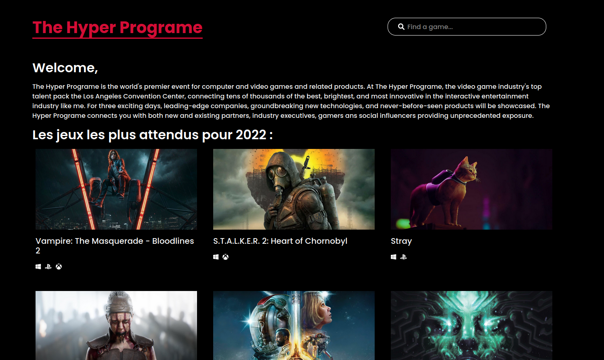

<h1 align="center">
   
  
   
THE HYPER PROGRAME 
</h1>
<h4 align="center">App for reseach information about Video Games using RAWG API</h4>
 

## WEB version 🌐

Le site est en live ici 👉 [THE HYPER PROGRAME](https://guillaume-rygn.github.io/The-Hyper-Programe/)

## Technologies utilisées ⚙️

Pour ce programme les technologies suivantes ont été utilisé :  

 
 
Le site est responsive et a été créé via WEBPACK. Bonne découverte !

## Crédit 🔗
[Guillaume Reygner](https://github.com/guillaume-rygn)
